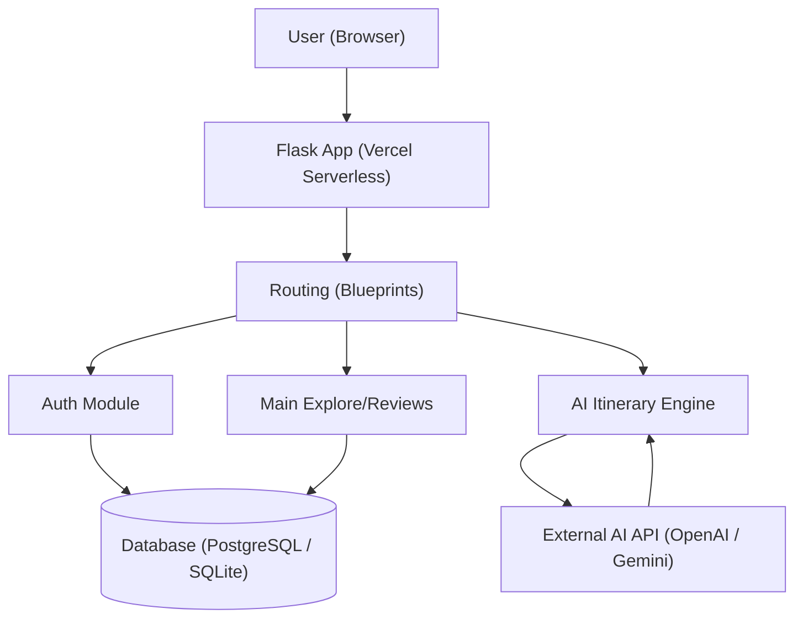

<div align="center">

<picture>
  
</picture>

### QuestWay — Travel Intelligence for Deliberate Wanderers

**A considered guide for travelers who read carefully before they book.**

*Real reviews, AI-assisted itineraries, and a community of travelers who plan carefully and wander deliberately.*

[](https://github.com/ardamoustafa1/Quest-Way/stargazers)
[](LICENSE)
[](https://flask.palletsprojects.com/)
[](https://quest-way-2024.vercel.app/)
[](#-ai-itinerary-generator)

[**Get started**](#-quick-start) · [How it works](#-how-it-works) · [Live Demo](https://quest-way-2024.vercel.app/) · [Architecture](#architecture) · [Features](#-core-features)

</div>

---

## 🌍 Start here

QuestWay is a modern travel intelligence platform designed for the modern wanderer. It moves beyond generic travel advice by combining **community-driven insights**, **authentic reviews**, and **AI-powered itinerary planning**. 

It is built on a solid Python/Flask foundation, seamlessly deployed on Vercel, and wrapped in a premium, modern, and accessible user interface.

### What makes QuestWay different?

| Generic Travel Apps | QuestWay |
|---|---|
| Overwhelming, unverified reviews | Curated, high-signal community reviews |
| Static, one-size-fits-all guides | Personalized AI-generated itineraries |
| Cluttered interfaces | Premium, distraction-free reading experience |
| Endless scrolling | Intentional exploration by continent and country |

<details>
<summary><b>Table of contents</b></summary>

- [Quick Start](#-quick-start)
- [Core Features](#-core-features)
- [How It Works](#-how-it-works)
- [System Architecture](#system-architecture)
- [Deployment](#deployment)
- [Community](#community)

</details>

---

## ⚡ Quick Start

### Local Development Setup

To run QuestWay locally on your machine, follow these steps:

**1. Clone the repository**
```bash
git clone https://github.com/ardamoustafa1/Quest-Way.git
cd Quest-Way
```

**2. Create a virtual environment**
```bash
python -m venv venv
source venv/bin/activate  # On Windows: venv\Scripts\activate
```

**3. Install dependencies**
```bash
pip install -r requirements.txt
```

**4. Configure Environment Variables**
Create a `.env` file in the root directory and add the necessary keys (Database URL, Secret Keys, AI API Keys, etc.):
```env
FLASK_APP=app.py
FLASK_ENV=development
SECRET_KEY=your_secret_key
```

**5. Run the application**
```bash
flask run
```
Visit `http://127.0.0.html` to see the app running locally!

---

## 🧭 Core Features

QuestWay is built around three core pillars of travel intelligence:

### 1. Authentic Community Reviews
Travelers share highly detailed, categorized reviews (Accommodation, Food, Transport, Sights). Readers can mark reviews as "Helpful" and interact in a safe, moderated environment.

### 2. AI Itinerary Generator
Tell QuestWay where you are going, your budget, and your interests. Our AI engine compiles a day-by-day, optimized itinerary combining popular sights with hidden gems, saving you hours of research.

### 3. Deliberate Exploration
Explore destinations by continent and country. Every location page features essential travel intelligence: local customs, safety tips, visa requirements, and curated spots.

---

## 🔍 How It Works

QuestWay's architecture is designed to be lightweight, fast, and scalable.



### The Stack

| Layer | Technology |
|---|---|
| **Backend** | Python 3, Flask, SQLAlchemy |
| **Frontend** | HTML5, CSS3 (Vanilla, CSS Variables), Jinja2 |
| **Security** | Flask-Talisman (CSP), CSRF Protection |
| **Deployment** | Vercel (Serverless Python), GitHub Actions |
| **AI Engine** | LLM integration for dynamic trip planning |

---

## 🚀 Deployment

QuestWay is fully optimized for serverless deployment on Vercel using the `@vercel/python` builder and legacy static routing to ensure maximum compatibility and zero route collisions.

To deploy your own instance:
1. Push your code to GitHub.
2. Import the project in Vercel.
3. Vercel will automatically read `vercel.json` and build the application.
4. Add your `.env` variables to the Vercel Dashboard.

---

## 🤝 Community & Contributing

QuestWay grows through the contributions of travelers and developers alike.

- **Found a bug?** Open an issue in the repository.
- **Have a feature idea?** Join the Discussions tab.
- **Want to contribute code?** Fork the repo, create a feature branch, and submit a PR.

---

## License

MIT — see [LICENSE](LICENSE). Use it, fork it, and plan your next great adventure.

<div align="center">

**Wander further. Plan smarter.**

</div>
